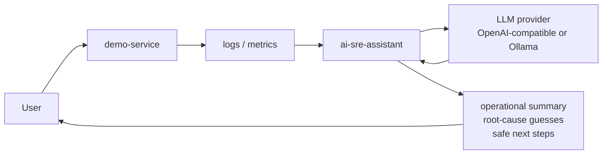

# ai-infra-starter-kit

Simple first. Production-minded always.

`ai-infra-starter-kit` is a practical learning lab for AI infrastructure. It starts with a normal web service, adds logs and metrics, then uses an AI SRE Assistant to explain what is happening operationally.

The first version runs on a normal laptop. No GPU, Kubernetes, vLLM, Triton, Ray, KServe, or full MLOps platform is required on Day 1.

## Who This Is For

This project is for developers, DevOps engineers, platform engineers, and cloud engineers who understand production systems but are new to AI infrastructure.

AI infra feels intimidating because the ecosystem often starts in the deep end: model servers, GPU scheduling, distributed inference, autoscaling, observability, evals, safety, and cost controls all appear at once. This starter kit introduces those ideas in order:

local app -> AI service -> logs/metrics -> AI SRE assistant -> observability -> containers -> Kubernetes -> production considerations.

## What You Build

- `demo-service`: a FastAPI service that behaves like a small production API.
- `ai-sre-assistant`: a FastAPI service and CLI that reads the demo logs and explains incidents.
- Docker Compose wiring so both services share the same log file locally.
- Tests, sample logs, docs, and a 30-day roadmap for building in public.
- Incident walkthroughs that show how to reason from symptoms, metrics, logs, and safe next steps.

## Architecture



The AI assistant does not need an LLM key to work. If no provider is configured, it falls back to a deterministic rule-based analyzer so the project is useful for everyone.

## Quickstart

```bash
git clone https://github.com/your-username/ai-infra-starter-kit.git
cd ai-infra-starter-kit
cp .env.example .env
make up
make test
make generate-traffic
make analyze-logs
make down
```

If `make` is not installed, run the same workflow directly:

```bash
docker compose up --build -d
docker compose build demo-service ai-sre-assistant
docker compose run --rm --no-deps demo-service pytest -q
docker compose run --rm --no-deps ai-sre-assistant pytest -q
python scripts/generate-demo-traffic.py --base-url http://localhost:8000
docker compose run --rm --no-deps ai-sre-assistant python cli/sre.py analyze --max-lines 120
docker compose down
```

Useful local URLs:

- Demo service: `http://localhost:8000`
- Demo health: `http://localhost:8000/health`
- Demo metrics: `http://localhost:8000/metrics`
- AI SRE Assistant: `http://localhost:8001`
- AI SRE health: `http://localhost:8001/health`

Ask the assistant directly:

```bash
curl -s -X POST http://localhost:8001/ask \
  -H "Content-Type: application/json" \
  -d '{"question":"Why is the demo service failing?","max_lines":120}'
```

## Repository Structure

```text
ai-infra-starter-kit/
  apps/
    demo-service/        # FastAPI app that emits health, failure, latency, logs, and metrics
    ai-sre-assistant/    # FastAPI app and CLI that analyze demo-service logs
  docs/                  # Learning path and production notes
    incidents/           # Guided operational debugging examples
  infra/                 # Docker, Kubernetes, and Terraform starter notes
  scripts/               # Local traffic and log helper scripts
  examples/              # Sample logs and questions
```

## How The Apps Work Together

1. You run both apps with Docker Compose.
2. `demo-service` writes JSON logs to `/shared/logs/demo-service.log`.
3. The host maps that file to `./logs/demo-service.log`.
4. `ai-sre-assistant` reads the same file.
5. The assistant separates facts from guesses, cites log evidence, and recommends safe next debugging steps.

## Example Workflow

```bash
make up
make generate-traffic
make analyze-logs
```

You should see the assistant report intentionally generated 500s, latency spikes, warning-level events, and which endpoints were involved.

## Roadmap

- Week 1: local demo-service, AI SRE Assistant, Docker Compose, sample logs, basic README.
- Week 2: observability basics, metrics, dashboards, structured logging, incident examples.
- Week 3: Kubernetes manifests, deployment walkthrough, config/secrets, health checks, resource limits.
- Week 4: security hardening, cost optimization, evaluation basics, optional advanced serving path with vLLM, Triton, and KServe.

## Build In Public

This repo is designed to be built in public one small step at a time. Good updates to share:

- What broke today.
- What concept became clearer.
- What was intentionally left out.
- How a local-only version maps to production thinking.
- Where AI infra gets complicated and why.

Start with `docs/build-log.md`.

## Lessons Learned

Day 1 lessons are intentionally simple:

- AI infrastructure is still infrastructure.
- Logs, health checks, and clear failure modes matter before GPUs.
- An AI assistant is more useful when it is grounded in evidence.
- A deterministic fallback keeps the project accessible.
- Simple first does not mean toy forever.

## Contributing

Contributions should keep the learning path gradual. Before adding a new tool, explain the problem it solves and where it fits in the local app -> production-minded path. See `CONTRIBUTING.md` for details.
