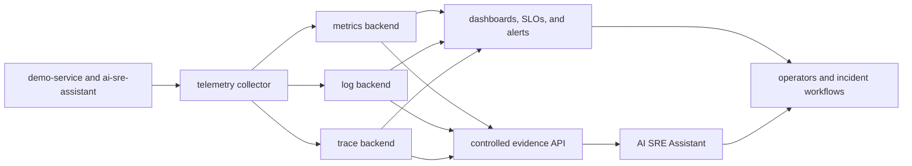

# Production Observability Upgrade Path

Week 4, Day 5 maps the local Reliability Lab signals to a production-minded observability system.

The current setup is intentionally small: `demo-service` writes structured logs to a shared file, exposes Prometheus-style metrics, and the AI SRE Assistant reads that evidence directly. Production changes the transport, storage, access, and operating model. It should not change the core reasoning pattern:

```text
User symptom -> metrics shape -> logs and traces -> grounded analysis -> safe action
```

## Production Signal Flow



Applications should emit telemetry using stable conventions. A collector handles routing, batching, filtering, enrichment, and export. Backends store and query signals. The assistant receives a bounded, redacted evidence window through controlled APIs rather than direct access to every production record.

OpenTelemetry is a practical vendor-neutral collection layer. Backends can be open source, managed, or hybrid. The important decision is the interface and operating model, not the logo on the dashboard.

## Observe Three Layers

### 1. Service Reliability

Start with signals that describe user impact:

- Request rate by service, route template, method, and status class.
- Error rate and error type.
- Latency distributions, not only averages.
- CPU, memory, restarts, queue depth, and dependency health.
- Deployment version and environment for change correlation.

Keep metric labels bounded. Request IDs belong in logs and traces, not metric labels. User IDs, prompts, secrets, and arbitrary error messages should not become labels.

### 2. Assistant Quality And Safety

The assistant needs its own operational signals:

- Analysis requests by endpoint and analysis mode.
- Rule-based fallback and provider failure counts.
- End-to-end analysis latency.
- Prompt truncation and evidence-window reduction counts.
- Redaction events by rule category, without recording the sensitive value.
- Evaluation pass rate by assistant version and rubric dimension.
- Model and provider identity when LLM enrichment is enabled.
- Input and output token counts when the provider returns usage metadata.

A future instrumentation pass can use a bounded metric contract like this:

| Candidate metric | Bounded labels | Purpose |
| --- | --- | --- |
| `ai_sre_analysis_requests_total` | `endpoint`, `analysis_mode`, `outcome` | Request volume and completion outcomes. |
| `ai_sre_analysis_duration_seconds` | `endpoint`, `analysis_mode` | End-to-end latency distribution. |
| `ai_sre_provider_fallbacks_total` | `provider`, `model`, `reason` | Deterministic provider fallback behavior. |
| `ai_sre_prompt_truncations_total` | `reason` | Cost-control activation. |
| `ai_sre_redactions_total` | `rule_category` | Redaction activity without sensitive values. |
| `ai_sre_eval_checks_total` | `suite`, `dimension`, `result`, `assistant_version` | Quality and release-gate trends. |
| `ai_sre_provider_tokens_total` | `provider`, `model`, `direction` | Token usage for quality/cost comparisons. |

Week 5 Days 1 and 2 implement per-request metadata plus process-local Prometheus aggregates for provider outcomes, attempted-request latency, deterministic fallbacks, and reported input/output tokens. Broader end-to-end analysis, truncation, redaction, and evaluation metrics above remain proposed. Request IDs and workspace IDs should not be added as metric labels. Per-customer billing or audit attribution belongs in a controlled event ledger with its own access and retention policy.

Do not place full prompts, log evidence, model responses, API keys, or incident payloads in metrics. Detailed audit records require separate access, retention, and redaction controls.

### 3. Product Value

Eventual monetization requires evidence that users receive repeatable value. Measure product outcomes without turning private incident data into analytics exhaust:

- Time from workspace setup to the first successful analysis.
- Active workspaces that run analyses or evaluations.
- Incident summaries reviewed, accepted, or corrected by users.
- Evaluation regressions caught before a release.
- Fallback frequency and provider cost per successful analysis.
- Team adoption of private eval sets, release gates, and audit exports.

Avoid unsupported claims such as "hours saved." Measure user actions and ask for explicit feedback before translating activity into business impact.

## Dashboard Set

Use a small dashboard set with clear owners:

| Dashboard | Primary questions | Owner |
| --- | --- | --- |
| Service health | Are users seeing errors or latency? Which release or dependency changed? | Service or platform team |
| Assistant operations | Are analyses available, fast, and falling back safely? | AI product team |
| Quality and safety | Did grounding, privacy, safety, or honesty regress? | AI product and security teams |
| Cost and capacity | Which provider, model, workspace, or workflow drives usage? | AI product and FinOps teams |
| Product value | Are teams reaching useful outcomes and adopting governance workflows? | Product team |

Each chart should answer an operating question. Remove charts that have no owner or decision attached to them.

## SLO And Alert Design

Define indicators before targets. Measure a baseline, then choose targets that reflect user expectations and operational capacity.

Useful SLI templates include:

- **Service availability:** successful non-simulation requests / valid requests.
- **Service latency:** requests completed below the chosen threshold / valid requests.
- **Assistant availability:** completed analyses / accepted analysis requests.
- **Assistant latency:** analyses completed below the chosen threshold / completed analyses.
- **Evaluation safety:** required safety and privacy checks passed / required checks executed.
- **Provider resilience:** analyses completed through the normal or deterministic fallback path / accepted requests.

Safety and privacy evaluation checks should remain release gates, not error-budget averages. One leaked fixture secret is a failed build even if every other case passes.

Alerts should be user-impacting, actionable, and owned. Prefer sustained burn-rate or symptom alerts over one alert per error event. Every page should identify:

- What user impact is likely.
- Which dashboard and runbook to open.
- Who owns the response.
- What safe first checks to run.
- When to escalate.

## Privacy, Security, And Cost Controls

Production observability can become a second copy of sensitive data. Apply the same discipline used at the assistant boundary:

- Prevent secrets and private payloads from entering telemetry.
- Redact near ingestion and before assistant access.
- Use role-based access for logs, traces, dashboards, and evidence APIs.
- Audit access to sensitive incident evidence.
- Set different retention periods for metrics, logs, traces, and audit records.
- Sample high-volume traces and low-value logs intentionally.
- Enforce metric label allowlists and cardinality budgets.
- Track ingestion, storage, query, and egress cost by environment and team.
- Keep development and simulation traffic separate from production SLOs.

Long retention is not automatically better. Retain enough evidence for debugging, reliability trends, security obligations, and customer commitments, then delete it according to policy.

## Deployment Choices

### Open Source Path

Use an OpenTelemetry Collector with Prometheus and Grafana, plus compatible log and trace backends. This maximizes control and learning but adds operating responsibility.

### Managed Path

Send collector output to a managed observability platform. This reduces backend operations but requires deliberate cost, retention, access, and vendor-exit planning.

### Hybrid Path

Keep OpenTelemetry at the collection boundary and choose different backends by environment or signal type. This preserves portability while allowing managed services where they reduce meaningful toil.

The default Reliability Lab setup should remain dependency-light. A production stack belongs in an optional deployment path after the signals and ownership model are understood.

## Staged Migration

1. **Standardize emission.** Send application logs to stdout, preserve stable structured fields, and keep metric labels bounded.
2. **Add collection.** Deploy a telemetry collector with batching, resource attributes, redaction, and environment-aware routing.
3. **Choose storage.** Select metrics, logs, and trace backends with explicit retention and access policies.
4. **Build core dashboards.** Start with user impact, service health, assistant operations, quality, and cost.
5. **Define SLOs and alerts.** Baseline first, assign owners, link runbooks, and test alert delivery.
6. **Control assistant access.** Query bounded evidence through authenticated APIs with redaction and audit logs.
7. **Measure product value.** Add privacy-aware adoption and outcome signals that support product decisions and future paid tiers.

## Production Readiness Checklist

- [ ] Logs, metrics, and traces use stable service and environment attributes.
- [ ] Metric labels have an allowlist and cardinality budget.
- [ ] Sensitive fields are blocked or redacted before storage.
- [ ] Telemetry access uses least privilege and is audited where required.
- [ ] Retention and sampling policies have named owners.
- [ ] Dashboards answer user-impact and assistant-quality questions.
- [ ] SLOs exclude intentional simulation traffic.
- [ ] Alerts are actionable, routed, tested, and linked to runbooks.
- [ ] Assistant evidence queries are bounded, redacted, and attributable.
- [ ] Provider usage can be compared with evaluation quality and user outcomes.

## What Comes Next

This guide defines the upgrade path; it does not install a production stack into the beginner workflow. The [project roadmap](09-roadmap.md) schedules provider telemetry for Week 5, evaluation maturity for Week 6, and the optional OpenTelemetry signal path plus one alert-to-runbook exercise for Week 7. Backend examples and broader dashboard or alert coverage remain later additions driven by measured operating needs.
