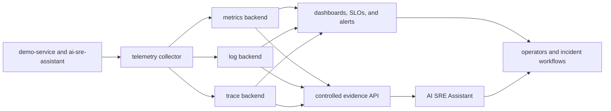

# Production Observability Upgrade Path

Week 4, Day 5 maps the local Reliability Lab signals to a production-minded observability system.

The current setup is intentionally small: `demo-service` writes structured logs to a shared file, exposes Prometheus-style metrics, and the AI SRE Assistant reads that evidence directly. Production changes the transport, storage, access, and operating model. It should not change the core reasoning pattern:

```text
User symptom -> metrics shape -> logs and traces -> grounded analysis -> safe action
```

## Production Signal Flow



Applications should emit telemetry using stable conventions. A collector handles routing, batching, filtering, enrichment, and export. Backends store and query signals. The assistant receives a bounded, redacted evidence window through controlled APIs rather than direct access to every production record.

## Observe Two Layers

### 1. Service Reliability

- Request rate by service, route template, method, and status class.
- Error rate and error type.
- Latency distributions, not only averages.
- CPU, memory, restarts, queue depth, and dependency health.
- Deployment version and environment for change correlation.

Keep metric labels bounded. Request IDs belong in logs and traces, not metric labels. User IDs, prompts, secrets, and arbitrary error messages should not become labels.

### 2. Assistant Quality And Safety

- Analysis requests by endpoint and analysis mode.
- Rule-based fallback and provider failure counts.
- End-to-end analysis latency.
- Prompt truncation and evidence-window reduction counts.
- Redaction events by rule category, without recording the sensitive value.
- Evaluation pass rate by assistant version and rubric dimension.
- Model and provider identity when LLM enrichment is enabled.
- Input and output token counts when the provider returns usage metadata.

Week 5 implements per-request metadata plus process-local Prometheus aggregates for provider outcomes, attempted-request latency, deterministic fallbacks, and reported input/output tokens. Request IDs and workspace IDs should not be added as metric labels. Durable audit records require separate access, retention, and redaction controls.

## Dashboard Set

| Dashboard | Primary questions | Owner |
| --- | --- | --- |
| Service health | Are users seeing errors or latency? Which release or dependency changed? | Service or platform team |
| Assistant operations | Are analyses available, fast, and falling back safely? | Maintainer |
| Quality and safety | Did grounding, privacy, safety, or honesty regress? | Maintainer and security reviewer |
| Cost and capacity | Which provider or model drives usage? | Maintainer |

Each chart should answer an operating question. Remove charts that have no owner or decision attached to them.

## SLO And Alert Design

Start with a small set of indicators:

- Service availability: successful requests divided by all requests.
- Service latency: a chosen percentile for a bounded route group.
- Assistant availability: completed analyses divided by requested analyses.
- Assistant latency: time from request receipt to final response.
- Evaluation safety: passing safety and privacy checks divided by all checks.
- Provider resilience: provider failures and deterministic fallbacks over provider selections.

Attach an owner, runbook, and escalation path to every alert. Alert only when an operator can make a different decision from the signal.

## Privacy And Cost Controls

- Keep prompts, evidence, model output, credentials, endpoints, and identifiers out of metrics labels.
- Bound high-cardinality dimensions before emitting telemetry.
- Use sampling and retention limits for detailed traces and logs.
- Separate operational telemetry from detailed evidence access.
- Treat provider usage and cost estimates as operational signals, not durable metering.

## Migration Path

1. Keep the local shared-log path for the quickstart.
2. Emit structured stdout logs and stable correlation fields.
3. Introduce a collector once signal contracts are stable.
4. Route metrics, logs, and traces to a chosen backend.
5. Build one dashboard and one owned alert.
6. Exercise one incident end to end: alert, evidence, analysis, runbook action, and recovery review.
7. Revisit retention, access, and cardinality after real operational use.

The local setup remains valuable because it teaches the signal path without requiring a full observability stack.
