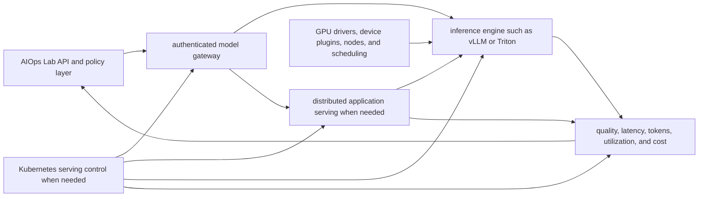

# Advanced Model Serving Roadmap

Week 4, Day 6 defines when AIOps Lab should move beyond external model providers and which serving layer should solve each production problem.

The project does not need GPUs or a self-hosted model to remain useful. The deterministic analyzer and optional OpenAI-compatible provider path should stay the default until customer requirements or measured workload economics justify more infrastructure.

## Day 6 Decision

Advanced serving is not one upgrade. It is a sequence of decisions:

```text
Need an LLM?
  no -> deterministic analysis
  yes -> external or managed provider
           |
           +-> keep using it while quality, privacy, latency, and unit economics work
           |
           +-> self-host only when measured requirements justify ownership
```

A framework should enter the architecture because it removes a demonstrated constraint. Adding vLLM, Triton, Ray, KServe, and GPU nodes at the same time would multiply failure modes without proving user value.

## Adoption Gates

Consider self-hosted inference only when at least one gate is backed by evidence:

- **Privacy or deployment boundary:** customers require a private VPC, dedicated environment, regional deployment, or on-premises operation.
- **Model control:** the product needs a model, adapter, quantization, context configuration, or release schedule that a provider does not support.
- **Latency:** measured provider latency prevents an agreed user workflow or SLO.
- **Volume economics:** sustained demand makes self-hosted cost per successful analysis competitive after all operating costs are included.
- **Availability control:** provider limits or outages materially affect the product and a self-hosted fallback has a justified reliability role.
- **Multi-model workload:** the product must serve several predictive or generative models with different runtime and scaling needs.

Do not self-host because GPU infrastructure looks impressive. Low utilization, uncertain demand, and an unmeasured workload usually make managed inference the more rational starting point.

## Serving Layers



The AIOps Lab API remains the product boundary. It owns evidence access, redaction, evaluation, policy, quotas, auditability, and user workflows. Serving frameworks provide model execution and orchestration underneath that boundary.

## What Each Tool Solves

| Layer | Use it when | It earns its place by | Skip it when |
| --- | --- | --- | --- |
| vLLM | The product self-hosts supported language models behind an OpenAI-compatible API. | Improving LLM throughput or memory efficiency and supporting single-node or distributed parallelism. | External providers still satisfy privacy, quality, latency, and cost requirements. |
| NVIDIA Triton Inference Server | The platform serves multiple model formats, predictive models, ensembles, or workloads needing configurable schedulers and batching. | Standardizing multi-framework inference, model repositories, concurrency, and dynamic batching. | The workload is only a straightforward language model already handled by a simpler engine. |
| Ray Serve | The inference application has Python-native preprocessing, routing, fan-out, model composition, or components that need independent CPU/GPU scaling. | Scaling a distributed application graph and its components separately. | One model endpoint and normal Kubernetes deployment primitives are enough. |
| KServe | A Kubernetes platform team needs declarative model lifecycle, standardized runtimes, networking, rollout, and autoscaling patterns across many models or teams. | Providing a shared Kubernetes serving control plane instead of custom manifests per workload. | The team has one deployment, limited Kubernetes operating capacity, or no platform standardization problem. |
| Kubernetes GPU scheduling | Any containerized inference workload needs specialized hardware. | Making GPUs discoverable and schedulable through vendor drivers, device plugins, resource requests, and node placement controls. | The workload remains provider-hosted or CPU-only. |

These tools overlap and can be combined. vLLM can be the LLM engine under a larger Ray Serve or KServe deployment. Triton can serve diverse model types behind a platform layer. The goal is the smallest stack that meets measured requirements, not one stack containing every project.

## Maturity Path

### Stage 0: Provider-First Product

Keep deterministic analysis as the free and reliable baseline. Use an external OpenAI-compatible provider only for optional enrichment. Measure quality, token use, latency, fallback frequency, and cost per successful analysis.

### Stage 1: Local Compatibility Test

Point the existing OpenAI-compatible client at a private development endpoint. A vLLM server can fit the existing configuration shape:

```text
LLM_PROVIDER=openai
OPENAI_BASE_URL=http://private-model-endpoint:8000/v1
OPENAI_API_KEY=local-or-gateway-token
MODEL_NAME=approved-model-name
```

This is a compatibility experiment, not a production deployment. Keep authentication at the gateway and never commit a real token.

### Stage 2: Single-GPU Benchmark

Serve one approved model on one GPU. Run sanitized incident cases and representative concurrency. Compare it with the current provider path using the same evaluation corpus and acceptance gates.

### Stage 3: Production Inference Service

Add hardened images, model artifact controls, health checks, resource limits, bounded queues, timeouts, rollout and rollback procedures, centralized telemetry, and an on-call owner. Keep one serving engine unless a second one solves a measured workload need.

### Stage 4: Shared Serving Platform

Introduce Ray Serve for distributed application composition or KServe for Kubernetes-wide serving standards only after multiple deployments or teams create repeatable platform work. Triton becomes relevant when multi-framework and model-repository requirements are real.

### Stage 5: Commercial Multi-Tenant Operation

Add tenant isolation, quotas, metering, policy enforcement, regional placement, capacity reservations, chargeback, support processes, and customer-facing reliability commitments. Multi-tenancy must not rely on metric labels or shared prompt logs for billing attribution.

## Benchmark Before Buying GPUs

Use the same sanitized incident workload for providers and self-hosted candidates. Test realistic input sizes, output sizes, concurrency, and burst patterns.

Measure:

- Evaluation pass rate by grounded, useful, safe, private, and honest dimensions.
- Time to first token for interactive streaming workloads.
- Time per output token and total response latency.
- Requests and tokens completed per second.
- Queue time, rejection rate, timeout rate, and fallback rate.
- GPU utilization, memory use, out-of-memory events, and model load time.
- Cost per request and cost per successful evaluated analysis.
- Operator time, deployment frequency, recovery time, and incident burden.

Quality is a gate before throughput. A faster model that fails required privacy, safety, or grounding checks is not a cheaper product.

## Unit Economics

Provider and self-hosted costs must be compared on the same outcome:

```text
provider cost per successful analysis
  = provider spend / successful evaluated analyses

self-hosted cost per successful analysis
  = (GPU + nodes + storage + networking + observability + engineering + support)
    / successful evaluated analyses
```

Include idle capacity, failed requests, cold starts, model downloads, redundancy, and on-call work. GPU hourly price alone is not the self-hosted cost.

Track contribution margin by plan or deployment type only after metering is trustworthy. Do not promise savings before a representative benchmark and sustained utilization profile exist.

## GPU Operating Requirements

A production GPU path needs more than `nvidia.com/gpu: 1`:

- Compatible GPU nodes, drivers, container runtime integration, and vendor device plugins.
- Dedicated node pools with labels, taints, tolerations, and explicit resource requests.
- Capacity limits, quotas, priority rules, and protection against one tenant consuming the fleet.
- Model and image caching strategies with controlled artifact provenance.
- Memory-aware model placement and tested out-of-memory recovery.
- Autoscaling signals based on queues, concurrency, token throughput, or utilization rather than CPU alone.
- Cold-start budgets and a deliberate choice between minimum capacity and scale-to-zero savings.
- GPU utilization, memory, temperature, errors, queue depth, latency, and cost telemetry.
- Upgrade testing across drivers, CUDA libraries, serving engines, models, and Kubernetes components.

Autoscaling cannot create GPU capacity that the cluster or cloud account does not have. Capacity planning and reservation strategy remain product and operational decisions.

## Security And Governance

Self-hosting moves responsibility into the product team:

- Verify model licenses and allowed commercial use.
- Control model sources, hashes, artifacts, container images, and dependencies.
- Protect model weights, adapters, prompts, retrieved evidence, and generated output.
- Authenticate every inference endpoint and restrict network paths.
- Separate tenant evidence, quotas, caches, and audit records.
- Apply redaction before model access and before durable telemetry.
- Version prompts, models, serving configuration, and evaluation results together.
- Require evaluated rollouts, canaries, and rollback paths.

A private deployment is not automatically secure. It only changes who owns the controls.

## Monetization Possibilities

The serving engine should not be the product moat. Open-source inference projects will continue to improve. AIOps Lab can monetize the operational and governance layer that customers repeatedly need.

| Possible tier | User outcome | Potential paid capabilities |
| --- | --- | --- |
| Community | Learn and run evidence-grounded incident analysis locally. | Deterministic analysis, provider-compatible configuration, public eval corpus, and deployment guidance remain open. |
| Team | Adopt the assistant safely across a shared engineering workflow. | Hosted evaluation history, collaboration, private incident sets, quotas, usage and cost dashboards, and CI release gates. |
| Enterprise cloud | Connect production telemetry with stronger governance. | SSO, RBAC, audit exports, policy controls, private connectors, regional data handling, reliability commitments, and support. |
| Private deployment | Meet VPC, dedicated, or on-premises requirements. | Customer-controlled model endpoints, approved model catalog, deployment automation, upgrades, capacity planning, and enterprise support. |
| Platform | Operate models and assistant workflows across teams or clusters. | Fleet policy, routing, model lifecycle, chargeback, benchmark comparisons, capacity governance, and multi-cluster visibility. |

The commercial value is measurable trust and operational control: customers can choose a provider or private model without rebuilding evaluation, evidence policy, observability, quotas, and audit workflows.

## Build Versus Buy Rule

Continue buying inference while it accelerates product learning and meets customer requirements. Build a self-hosted path when it unlocks signed demand, resolves a hard deployment constraint, or improves measured unit economics after operating cost.

Before committing to a serving platform, require:

- A named customer or product requirement.
- A representative benchmark and quality gate.
- A 12-month cost model with utilization assumptions.
- An operating owner and incident response plan.
- A security and model-license review.
- A rollback to the provider or deterministic path.

## Recommended Implementation Order

The first four steps are the measurement work scheduled for Weeks 5-8 of the [project roadmap](09-roadmap.md). Serving infrastructure begins only when those steps support it:

1. Capture provider token usage, model identity, latency, outcome, fallback, and cost metadata in Week 5.
2. Expand and version the evaluation corpus in Week 6 so every candidate uses the same privacy and safety gates.
3. Stabilize the optional production signal path and operational exercise in Week 7.
4. Run the provider-versus-private-endpoint benchmark and record the build-versus-buy decision in Week 8.
5. Test one approved model behind an authenticated OpenAI-compatible endpoint only when the decision supports it.
6. Add an optional single-GPU deployment example without changing the default quickstart.
7. Prove quality, reliability, and unit economics under representative load.
8. Add Kubernetes GPU scheduling and observability for a real deployment requirement.
9. Introduce Ray Serve, Triton, or KServe only when its specific orchestration problem appears.
10. Package private deployment, governance, metering, and support around validated customer demand.

## Day 6 Definition Of Done

- The default AIOps Lab path still requires no GPU.
- Each advanced tool maps to a specific problem and adoption gate.
- Provider and self-hosted options use the same evaluation standard.
- GPU cost is compared per successful analysis, including operations.
- Private deployment and multi-tenancy have explicit security requirements.
- Monetization focuses on customer outcomes, governance, and support rather than reselling an open-source engine.

## Official References

- [vLLM OpenAI-Compatible Server](https://docs.vllm.ai/en/latest/serving/online_serving/openai_compatible_server/)
- [vLLM Parallelism and Scaling](https://docs.vllm.ai/en/stable/serving/parallelism_scaling/)
- [NVIDIA Triton Inference Server](https://docs.nvidia.com/deeplearning/triton-inference-server/user-guide/docs/index.html)
- [Ray Serve Model Composition](https://docs.ray.io/en/latest/serve/model_composition.html)
- [Ray Serve Autoscaling](https://docs.ray.io/en/latest/serve/autoscaling-guide.html)
- [KServe Documentation](https://kserve.github.io/website/docs/intro)
- [Kubernetes GPU Scheduling](https://kubernetes.io/docs/tasks/manage-gpus/scheduling-gpus/)
