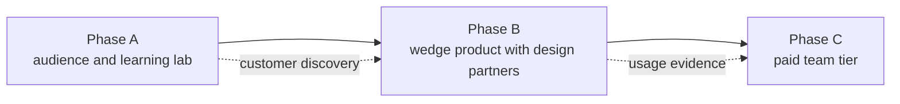

# Commercialization Roadmap

This document turns the product direction from `docs/19-advanced-model-serving-roadmap.md` and the next-stage priorities from `docs/20-production-readiness-review.md` into a sequenced plan with milestones and success metrics.

The strategy is deliberate: audience first, wedge product second, paid tiers third. Each phase funds and de-risks the next, and no phase starts before the previous phase's exit criteria are met.

## Strategy Summary

The AI incident-copilot market is crowded with well-funded products. AIOps Lab does not win by out-building them from a standing start. It wins by:

1. Teaching an underserved audience (production engineers new to AI infra) and earning distribution through the open learning lab.
2. Converting that audience into customer discovery for a narrow wedge: an evidence-grounded incident analyst whose quality is enforced by a CI evaluation gate.
3. Monetizing the trust and governance layer — evaluation history, private incident sets, redaction policy, audit — not the inference engine.

## Phase A: Public Release and Audience (Months 0-3)

Goal: publish the learning lab, build a distribution channel, and validate that the audience exists and will engage.

### Milestones

| Milestone | Definition of done |
| --- | --- |
| Public release | `make validate` passes, naming is consistent, and the repository is public with a clear README, license, and contribution guide. |
| Launch posts | A "Show HN" or equivalent launch post plus at least one written walkthrough of an incident analysis session. |
| Content cadence | One build-in-public post per week for eight consecutive weeks, sourced from `docs/build-log.md` and the incident walkthroughs. |
| Contact channel | An email list or equivalent owned channel that readers can join from the README. |
| First paid validation | One small paid artifact live: a deep-dive course, ebook, workshop, or sponsorship. Revenue target is trivial; the goal is proof that someone pays. |
| Customer discovery | Fifteen structured conversations with SRE, DevOps, or platform engineers who used or starred the project, each answering: "What would it take for you to point this at your real logs?" |

### Success metrics

- 1,000+ GitHub stars or 200+ unique cloners per month.
- 300+ owned-channel subscribers.
- 15 completed discovery interviews with written notes.
- At least 3 interviewees who describe a current, painful incident-analysis workflow they would change.
- First dollar of revenue from any source.

### Exit criteria for Phase B

Proceed only when discovery interviews converge on a repeated, specific pain and at least three teams volunteer to try the assistant against their own sanitized telemetry. If interviews do not converge, stay in Phase A and adjust the audience or the message — do not start building the wedge on guesses.

## Phase B: Wedge Product with Design Partners (Months 3-6)

Goal: make the assistant useful against real telemetry for two or three design-partner teams, free, in exchange for feedback and permission to reference them.

The wedge thesis: teams will adopt an incident analyst they can hold to a measurable quality bar. The evaluation harness is the differentiator; the assistant is the demo.

### Milestones

| Milestone | Definition of done |
| --- | --- |
| First real connector | Read-only connector to one real log source (CloudWatch Logs, Loki, or Datadog), honoring the existing bounded-query and redaction policies. The shared-file path remains the learning default. |
| Provider metering | Model identity, latency, token usage, fallback outcome, and cost per successful analysis captured as metrics without storing prompt content (item 1 from `docs/20-production-readiness-review.md`). |
| Private incident sets | A team can record sanitized incidents from their own systems and run the evaluation corpus against them in CI, blocking regressions. |
| Minimum viable trust | OIDC/SSO authentication, per-user audit log of evidence access, and a documented single-tenant deployment using the existing Kubernetes manifests. |
| Design partners | Two or three teams running the assistant against sanitized real data weekly, with a shared feedback channel and written usage notes. |

### Success metrics

- 2-3 active design partners with weekly usage (not one-time trials).
- 10+ sanitized real incidents in partner evaluation sets.
- Assistant passes the five-dimension rubric (grounded, useful, safe, private, honest) on partner incidents, not just the public corpus.
- Measured cost per successful analysis for each provider configuration.
- At least one partner quote or case study approved for public use.
- Zero privacy or safety gate failures on partner data. Any failure stops the phase until resolved.

### Exit criteria for Phase C

Proceed when at least two design partners say they would pay to keep the workflow, and can articulate the budget it would come from. "This is neat" is not an exit signal; "we would lose something we now rely on" is.

## Phase C: Paid Team Tier (Months 6-12)

Goal: convert the design-partner workflow into the Team tier described in `docs/19-advanced-model-serving-roadmap.md`, with pricing validated against real willingness to pay.

### Milestones

| Milestone | Definition of done |
| --- | --- |
| Hosted evaluation history | Evaluation runs, thresholds, and pass/fail history stored per team with regression alerts, versioned alongside model, prompt, and corpus (the versioning contract from `docs/20-production-readiness-review.md`). |
| Usage and cost dashboards | Per-team visibility into analyses run, provider spend, fallback rate, and quality trend. |
| Quotas and budgets | Per-team token and spend limits with graceful degradation to the deterministic path. |
| Pricing and packaging | Public pricing page for the Team tier (per-seat) and a contact path for single-tenant private deployment (annual contract). Prices set from design-partner conversations, not guesses. |
| Billing and terms | Payment, invoicing, terms of service, privacy policy, and a support commitment appropriate to the price point. |
| First paying customers | Three paying teams, at least one converted from a design partner. |

### Success metrics

- 3+ paying teams; $1,000+ monthly recurring revenue as a floor signal, with growth month over month.
- Net revenue retention: no paying team churns within the first two quarters.
- Cost per successful analysis is measured, published internally, and gross-margin positive at the chosen price.
- Support load is sustainable for a single maintainer (or a hiring/contracting decision is made explicitly).
- Community tier remains fully useful: deterministic analysis, provider configuration, public corpus, and deployment guidance stay open.

## Explicit Non-Goals Until Gated

These stay behind the adoption gates in `docs/19-advanced-model-serving-roadmap.md` and require a named customer requirement:

- GPU deployment examples, vLLM, Triton, Ray Serve, KServe.
- Multi-tenant shared infrastructure (single-tenant deployments come first).
- A general observability platform. The product analyzes evidence; it does not replace Datadog, Grafana, or a log backend.
- Enterprise features (RBAC, policy controls, regional data handling) before an enterprise buyer exists.
- Fundraising decisions. This roadmap assumes bootstrap economics; revisit only with Phase C evidence.

## Operating Cadence

- **Weekly:** one build-in-public post; review metrics for the current phase.
- **Monthly:** compare actuals to the current phase's success metrics; write a one-paragraph verdict in `docs/build-log.md`.
- **Per phase:** hold the exit-criteria review before starting the next phase. Skipping a gate requires writing down why, what evidence overrides it, and what would trigger a rollback to the prior phase.

## Risks and Honest Caveats

- **Crowded market:** incumbents can ship an adequate incident summary as a feature. The defense is the evaluation-gated trust workflow and the audience, not the summary itself.
- **Audience does not convert:** educational audiences often read without buying. The Phase A paid artifact exists to test conversion early and cheaply.
- **Single maintainer:** every phase must remain operable by one person; any milestone that is not gets cut or simplified.
- **Privacy is existential:** one leaked secret in an analysis output would end trust in the product. Privacy and safety evaluation gates remain hard no-go gates in every phase, exactly as `docs/20-production-readiness-review.md` defines them.
